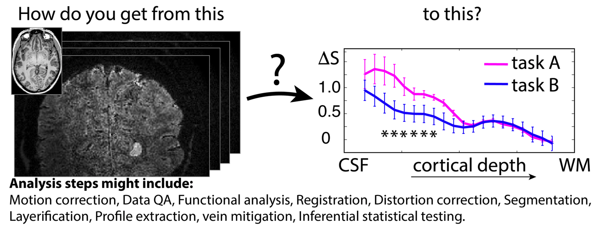

===========================
Analysis Project
===========================

**One dataset, many analyses: an overview of the diverse processing approaches in layer-fMRI.**

The layer-dinner group would like to invite you to show us your analysis pipeline in a brief presentation at an upcoming “Layer-fMRI dinner” in the Spring of 2022. The analysis of layer-fMRI data is challenging and not straightforwardly doable with standardized streamlines analysis packages. Most layer-fMRI groups have their own dedicated analysis solutions to account for layer-specific challenges. As such, the purpose of this event is:

- To illustrate multiple layer analyses of members of the field, and for others to follow.

- To highlight challenges of high-res and layer specific analysis.

- To stimulate discussion about analysis challenges and solutions.

- To give analysis developers a platform to advertise their analysis solutions.

- To illustrate differences and similarities of pipelines.

We challenge you to analyse an example dataset from the raw nii data to obtain task-dependent layer-profiles.

We would like to invite you to make a 10-30 min presentation showing your analysis pipeline.

The format of the presentation is up to you. It can be a causal explanation of you recording your screen while you go through the analysis, or it can be a traditional slide show. At the live event, there will be QnA and panel discussion about the various differences.

Open sharing of your results and corresponding analysis scripts is encouraged, but not absolutely mandatory.

It would be appreciated if you could highlight some intermediate results along the analysis pipeline (e.g. exemplifying the results after motion correction, registration, layerification, up to the final layer profiles).

Note that this is not meant as a contest to find the best analysis pipeline, nor is it a test to investigate how reproducible layer fMRI results are across pipelines.

An example presentation will soon be posted `here <http://www.layerfmri.page.com/pipeline_example>`_.

If you have any questions, please reach out to `Denis Chaimow <mailto:dchaimow@cbs.mpg.de>`_ or `Renzo Huber <mailto:renzohuber@gmail.com%20>`_.
