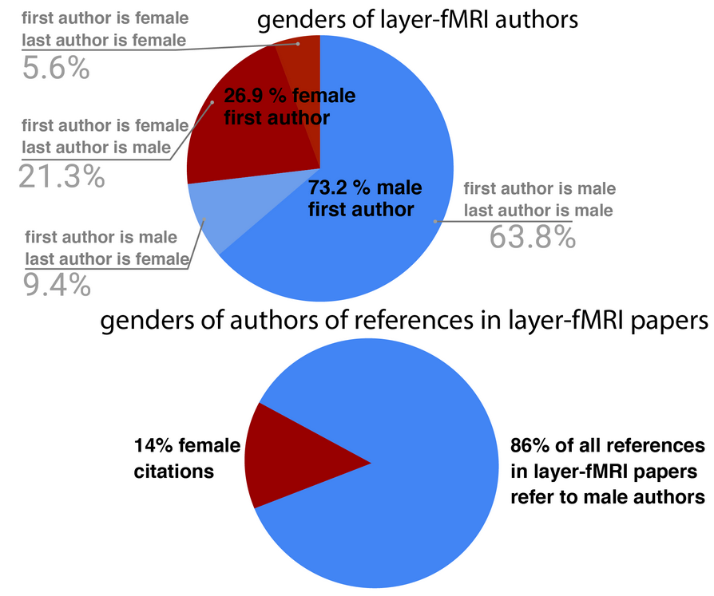
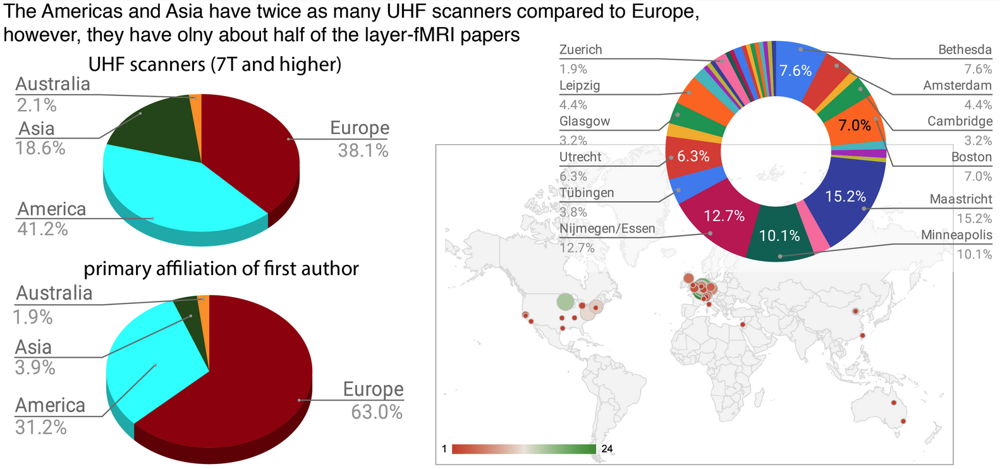

===============
Code of Conduct
===============

Introduction
------------

The field of layer-fMRI, and thus the layer-fMRI dinner group suffers from many biases. In this document we would like to discuss some of them as well as propose ways to tackle them.
This code is not exhaustive or complete. We ask the members of the layer-fMRI dinner group to follow it in spirit to create a safe and positive experience for all. Within this Code of Conduct we acknowledge that the layer-fMRI dinner group has serious issues about diversity, biases and communication standards. And we express our desire to work on these issues.

Gender bias
~~~~~~~~~~~

    Gender biases in Layer fMRI [Inspired by Neurosalience, a podcast conversation between Dani Bassett and Peter Bandettini]

Only one out of four Layer fMRI papers are authored by women. Moreover, only one out of seven references go to a woman authored citation (assumes binary genders based on first name with self-citations excluded). While we acknowledge gender identification to vary, we focus here on male/female. Layer-fMRI papers are dominated by male authors (see figure). Even if we take into account the relatively higher proportion of male authors, the reference lists of layer-fMRI papers are even more so biased towards males. We find this reference list gender bias unacceptable and our group is committed to reducing it.

|

Geographic bias
~~~~~~~~~~~~~~~

    Geographic biases in Layer fMRI:

There is a geographic imbalance of layer-fMRI labs and papers across continents. Europe dominates the field, even though Asia and the Americas have almost twice the number of layer-fMRI scanners. The Layer-fMRI Dinner group would like to encourage more geographic diversity.

Methods bias
~~~~~~~~~~~~

Layer-fMRI is a sub-field of fMRI where methods (sequence and analysis) are still being actively developed. There are countless anecdotal pieces of evidence of a destructive lack of open-mindedness towards new methods. For example, reviewers may have suggested to some authors for the work to be evaluated by physicists (or implied any particular lack of expertise from the authors), or a particular technique may have been criticised because it is not yet widely accepted. Analysis methods can be easily proven to be right or wrong depending on assumptions, but reviewers may have forgotten to evaluate if a particular approach is adequate to the goals. Finally, when given the opportunity to present the advancement of our field, we may have fallen into the temptation of advertising our own work.

Outdated conversation atmosphere
~~~~~~~~~~~~~~~~~~~~~~~~~~~~~~~~

The layer-dinner group would like to provide a forum for an open conversation about relevant issues in the field. However, until now most virtual layer-fMRI dinner events consisted of traditional monologue-style presentations from established researchers. In the future, we would like to improve our event format and our atmosphere. We want  to favour dialog over one-sided presentations and we want a discussion format that is more welcoming for the voices of young researchers.

We think such anecdotes and biases need to become a thing of the past. We hope that this code of conduct document can help us work on these biases to become a better and more welcoming community.

Scope of this Code of Conduct
-----------------------------

This Code of Conduct applies to all events (in-person or online online) managed by the layer-fMRI dinner group (aka laminauts). This includes the regular dinner meeting, discussions on SLACK, and in-person evening social events (actual dinners) during large international conferences (ISMRM, OHBM, etc). We expect our Code of Conduct to be honored by everyone who participates in the layer-dinner group community formally or informally and we wish for all to spread these good practices outside the layer-fMRI dinners and events.

Diversity statement
-------------------

The layer-fMRI dinner group is an international and multidisciplinary community focusing on using fMRI at a high spatial resolution (e.g. sub-millimetre) to access fundamental cortical units (layers and columns) that support cognition and behaviour. As a community, the layer-fMRI dinner group values diversity across its members. The layer-fMRI dinner group is therefore committed to creating an equitable environment where human diversity is welcomed and respected. While no list can hope to be comprehensive, we explicitly honor diversity in:

- ethnicity, gender identity or expression, and sexual orientation.

- culture, language, national origin, religion, race, and socioeconomic status.

- discipline (physicists, neuroscientists, engineers, computer scientists, etc.).

- age (seniority level of academic hierarchy, PhD students, post-docs, professors, institute leaders).

Finally, as a community we appreciate the use of a diverse set of approaches (e.g.  GE-BOLD, VASO, SE-BOLD) and tools (e.g. Freesurfer, BrainVoyager, AFNI, python, Matlab and R).

Promoting diversity
-------------------

In both public and private interactions, the layer-fMRI dinner group expects its members to be respectful of all community voices. Conversations should be direct, constructive, and positive. We expect members to respect and honor all forms of diversity. Community members are also encouraged to seek diverse perspectives. We will work to ensure that the crowd of actively organizing members and the board, and the speakers of the layer-fMRI dinner events reflect the diversity of the field. Specifically, the board will refrain from layer-fMRI dinner events  with all male panelists.

In addition, we suggest the layer fMRI community to adopt best citation practices (e.g. `Penders, 2018 <https://www.ncbi.nlm.nih.gov/pmc/articles/PMC5896885/>`_) and as a way to address the issue to include a citation gender diversity statement in manuscript and talks (e.g.  `Dworkin, et al. 2020 <https://www.nature.com/articles/s41593-020-0658-y?proof=t#citeas>`_, `cleanBib Diversity Statement Code <https://github.com/dalejn/cleanBib>`_)

Appreciating differences
------------------------

Layer-dinner group members come from many cultures and backgrounds. We therefore expect community members to be respectful of different cultural practices, attitudes, and beliefs. This includes being aware of preferred titles and pronouns, as well as using a respectful way of addressing each other. While we do not expect all members of the layer-fMRI dinner group to know the cultural practices of every discipline, ethnic, and cultural group, we expect members to recognize and appreciate differences within our community. This means being open to learning from and educating others, as well as educating yourself.

Behavior That Will Not Be Tolerated
-----------------------------------

We stand against discrimination in all forms and at every organizational level. Discrimination based on, but not limited to geographic location, gender, gender identity and expression, sexual orientation, disability, physical appearance, body size, accent, race, ethnicity, age or religion does not abide by our values. We do not tolerate discrimination or harassment of conference participants and organizers.
Harassment includes, but is not limited to:

- Verbal comments that reinforce social structures of dominance related to geographic location, gender, gender identity and expression, sexual orientation, disability, physical appearance, body size, race, age, religion.

- Unwelcome comments regarding a person’s lifestyle choices and practices, including those related to food, health, parenting, drugs, and employment.

- Sexual images in public spaces, including talks.

- Deliberate intimidation, stalking, or following

- Harassing photography or recording, including logging online activity for harassment purposes and all forms of cyberbullying

- Sustained disruption of talks or other events

- Inappropriate physical contact

- Unwelcome sexual attention

- Advocating for, or encouraging, any of the above behaviors

Enforcement
-----------

The layer-fMRI dinner group expects participants to follow the rules listed above at all event venues and event-related social and online activities. Participants asked to stop any harassing behavior are expected to comply immediately. If a participant engages in harassing behavior, event organizers retain the right to take any actions to keep the event a welcoming environment for all participants. At online events there are at least two moderators that can block and expel harassing attendees (i.e. remove participants of Zoom conference). For in-person events, we allocate part of the events funds for security personnel (as offered by the venue sites) that can help to remove harassing attendees from the site. Unacceptable behaviour will not be tolerated, incidences of sexual misconduct will be reported to the venue institution and authorities take any appropriate actions.

Reporting
---------

If someone makes you or anyone else feel unsafe or unwelcome, please report it as soon as possible to the board of the layer-dinner group. E.g. via SLACK as PM. Harassment reduces the value of our community for everyone.  You can make a report either personally or anonymously.

Anonymous report
~~~~~~~~~~~~~~~~

You can make an anonymous report in SLACK via the anonymous bot. Type ``/anonymous`` (no extra param) to open the dialog box. Type a message and click ``Send``. The bot will send the message without revealing your name. We cannot follow up an anonymous report with you directly, but we will investigate it to the best of our ability and take whatever action is necessary to prevent a recurrence.

Personal report
~~~~~~~~~~~~~~~

You can make a personal report by messaging any of the board members that you trust. The contact details of the board members are `here <https://laminauts.com/about/>`_.

When making a personal report, individuals from the board team will endeavor to use a location that is safe and private. We may involve event staff to ensure your report is managed properly. Once safe, we will ask you to tell us about what happened. This can be upsetting, but we will handle it with kindness and respect, and you can bring someone to support you. You will not be asked to confront anyone, and we will not reveal your identity. Your report will be treated confidentially and will be investigated to the best of our ability and we will take whatever action possible to prevent a recurrence.

Our team will be happy to help you contact hotel/venue/zoom security, local law enforcement, local support services, and to otherwise assist you to feel safe for the duration of the event. We value your attendance.

Suggestions
~~~~~~~~~~~

We know we can always do better. In addition to reporting, if you have comments or suggestions on how to do so, we invite you to reach out and let us know. Again, the contact details of all board members are listed `here <https://laminauts.com/about/>`_.

Acknowledgements
----------------

This statement has drawn material from the Organization of Human Brain Mapping, the Ada Initiative Code of Conduct, the Apache Software Foundation Code of Conduct, and the Mozilla Community Participation Guidelines.

Resources
---------

To inform yourself please consult any of these websites (not exhaustive list):

- `NIH Scientific Workforce Diversity Toolkit <https://diversity.nih.gov/>`_

- `NSF Statistics on Women, Minorities, and Persons with Disabilities in Science and Engineering <https://www.nsf.gov/statistics/2017/nsf17310/>`_

- `Growing Up in Science <https://www.cns.nyu.edu/events/growingupinscience/diversity.html>`_

- `Black Scientists Matter <https://www.blackscientistsmatter.com/>`_

- `Mothers is Science <https://www.mothersinscience.com/>`_

- `Female Empowerment at Maastricht University <https://www.maastrichtuniversity.nl/about-um/diversity-inclusivity/di-organisations/fem-female-empowerment-um>`_

- `Dutch Network of Female Professors <https://www.lnvh.nl/>`_

- `Association for Women in Science <https://www.awis.org/>`_

- `Graduate Women in Science <https://www.gwis.org/>`_
