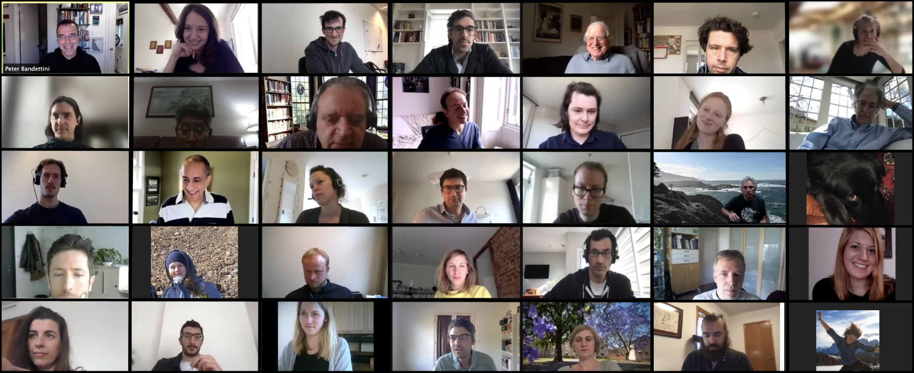

======================================
The Layer fMRI Dinner Group
======================================

.. toctree::
   :maxdepth: 2
   :hidden:

   about.rst
   coc.rst
   upcoming.rst
   analysis.rst
   proceedings/index.rst
   resources.rst
   contact.rst

|
|

|

The Layer fMRI Dinner Group is a collection of layer-fMRI researchers, trainees, methods developers, neuroscientists, and layer-enthusiasts (i.e. Laminauts), who organise regular dinner meetings.

Our aim is to provide a community-driven platform to discuss current issues, latest developments, and controversies in the field of layer-fMRI.

Latest News
###########

Some stuff is happening! Or maybe not...
