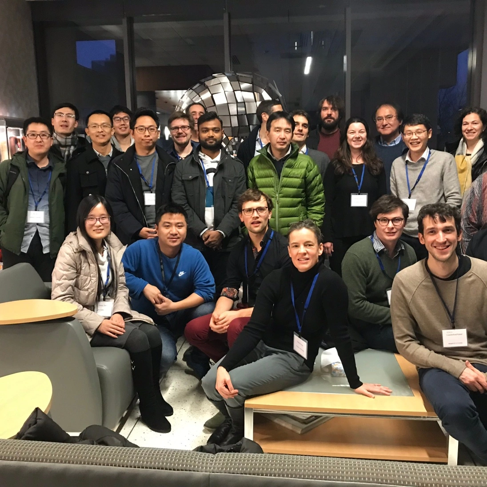

2019 Minnesota workshop on Cortical Depth-Resolved fMRI Methods
===============================================================

This post summarizes the presentation, tutorials, and discussions of the `2019 UHF Minnesota Workshop on Cortical Depth-Resolved fMRI Methods <https://www.cmrr.umn.edu/workshop2019/training.shtml>`_, Nov 12th-Nov 13th.

**Organiser**: Cheryl Olman

**Presenters**: Alessio Fracasso, Natalia Petridou, Jonathan Polimeni, Kamil Uludag, Tim van Mourik, and Renzo Huber

Terminology consensus
#####################

- Layerification: The process of assigning depth-values to each voxel.
- Lettuce Head: Levelset with acoustic noise.
- Partial Volume: Ill-defined term for partial coverage. A field of view that is smaller than what freesurfer considers as “whole brain”.

Cheryl Olman: Introductions and general outline
###############################################

.. raw:: html

   
<iframe width="750" height="422" src="https://www.youtube.com/embed/TvE4i6t2Deg" title="YouTube video player" frameborder="0" allow="accelerometer; autoplay; clipboard-write; encrypted-media; gyroscope; picture-in-picture" allowfullscreen></iframe>

Jonathan Polimeni: Overview of laminar fMRI best practices and current challenges
#################################################################################

.. raw:: html

   
<iframe width="750" height="422" src="https://www.youtube.com/embed/BGr6KASXRGI" title="YouTube video player" frameborder="0" allow="accelerometer; autoplay; clipboard-write; encrypted-media; gyroscope; picture-in-picture" allowfullscreen></iframe>

   
<iframe width="750" height="422" src="https://www.youtube.com/embed/qRSNW8a-ZAk" title="YouTube video player" frameborder="0" allow="accelerometer; autoplay; clipboard-write; encrypted-media; gyroscope; picture-in-picture" allowfullscreen></iframe>

Hot Topic discussions included:

- How many cytoarchitectonically-defined layers are there, is 6 really a good number?
- How should we estimate the PSF?
- Resolution losses from resampling should be kept as small as possible. Viable strategies include: 1.) working in upsampled space, 2.) combining (concatenating) all transformations into one single transformation, 3.) using adequate interpolation functions.
- Layer smoothing can be helpful to depict layer activation features, but they should always be accompanied with unsmoothed maps. Otherwise it can result in circularity.
- “shifting” the cortical depth based on the functional baseline signal a la Peter Koopmanns might introduce circularity. Tim: this approach is debunked.
- The accuracy of the surfaces (segmentation lines) is significantly higher than the voxel resolution. This is possible with predefined assumptions of signal intensities of GM and WM and a partial voluming model. -> higher resolution of the anatomy helps to improve the accuracy. However, it’s more important to keep the SNR up.

Renzo Huber: Hands on scanning at 7T scanning: Optimizing an EPI acquisition
############################################################################

.. raw:: html

   
<iframe width="750" height="422" src="https://www.youtube.com/embed/PngT6chFy6c" title="YouTube video player" frameborder="0" allow="accelerometer; autoplay; clipboard-write; encrypted-media; gyroscope; picture-in-picture" allowfullscreen></iframe>

- `Scanner protocols <https://github.com/layerfMRI/Sequence_Github/tree/master/CMRR_training_scann_protocol_pdfs>`_
- `Explanatory slides <https://layerfmri.page.link/CMRR_2019_scanning>`_
- `Example data <https://openneuro.org/datasets/ds001563/versions/1.0.1>`_
- Hot topic discussions were:
   - Does GRAPPA-regularization blur the data between neighboring voxels or between GRAPPA ghosts?
   - How to do phase-correction with navigators? Can we trust the EPI phase across time?

Tim van Mourik, Using GIRAFFE to set up analysis pipeline (boundary-based registration)
#######################################################################################

.. raw:: html

   
<iframe width="750" height="422" src="https://www.youtube.com/embed/mg4Ykp0n6E0" title="YouTube video player" frameborder="0" allow="accelerometer; autoplay; clipboard-write; encrypted-media; gyroscope; picture-in-picture" allowfullscreen></iframe>

   
<iframe width="750" height="422" src="https://www.youtube.com/embed/Z7jSWu8j2OY" title="YouTube video player" frameborder="0" allow="accelerometer; autoplay; clipboard-write; encrypted-media; gyroscope; picture-in-picture" allowfullscreen></iframe>

`Discussion of Giraffe Tools <https://giraffe.tools/porcupine/TimVanMourik/LayerAttention>`_

Alessio Fracasso: Hands on analysis: Segmentation and layerification without surfaces
#####################################################################################

- Digital capture failed; we’re working on creating a replacement
- Hot topic discussion:
   - The presented pipeline estimates layers with level-sets, without surfaces in voxel space.

fMRI contrasts: GE-BOLD, SE-BOLD and non-BOLD
##############################################

Natalia Petridou: GE, SE, GRASE
*******************************

.. raw:: html

   
<iframe width="750" height="422" src="https://www.youtube.com/embed/N6sBvdGoW_Q" title="YouTube video player" frameborder="0" allow="accelerometer; autoplay; clipboard-write; encrypted-media; gyroscope; picture-in-picture" allowfullscreen></iframe>

Hot Topic discussion:

- GRASE has the advantages of both GE-BOLD and SE-BOLD, or does GRASE have the disadvantages of both GE-BOLD and SE-BOLD?
- Different layers and different contrasts have different timing response functions.

Renzo Huber: non-BOLD (VASO, ASL ...)
*************************************

.. raw:: html

   
<iframe width="750" height="422" src="https://www.youtube.com/embed/npZIs9rEJc4" title="YouTube video player" frameborder="0" allow="accelerometer; autoplay; clipboard-write; encrypted-media; gyroscope; picture-in-picture" allowfullscreen></iframe>

Hot topic discussions:

- There is no clear winner of sequences. Sequence comparisons are never fair.

Kamil Uludag: T1-weighted EPI and laminar BOLD response modeling
****************************************************************

.. raw:: html

   
<iframe width="750" height="422" src="https://www.youtube.com/embed/1jqvs95kHW4" title="YouTube video player" frameborder="0" allow="accelerometer; autoplay; clipboard-write; encrypted-media; gyroscope; picture-in-picture" allowfullscreen></iframe>

Hot topic discussions:

- There is no easy ground-truth of tissue type segmentation. When comparing methods, one needs to look at both approaches.
- -> taking the difference between task conditions and using the layer-dependent activation difference for neuroscience interpretations is not adequate <- This does not mean that previous studies, who did this are necessarily wrong.
- The vein size difference across layers can be incorporated in the model as CBV.
- The vascular deconvolution method might come along with noise-amplification. When you have unreliable data quality to begin with, the deconvolution model might make more problems than it solves.
- The surprising CBF profiles are in agreement with previous studies from Ingo Marquardt and from electrophysiology.

Natalia Petridou: 3D-EPI
***************************

.. raw:: html

   
<iframe width="750" height="422" src="https://www.youtube.com/embed/AbriD3wgQno" title="YouTube video player" frameborder="0" allow="accelerometer; autoplay; clipboard-write; encrypted-media; gyroscope; picture-in-picture" allowfullscreen></iframe>

Hot topic discussions:

- It is not so straightforward to correct for physiological noise when you have long readouts in 3D-EPI. The most appropriate approach is to take it as a snapshot acquisition at k-space center.
- K-space based approaches like RetroKCor might be more appropriate for 3D-EPI
- It is not clear, why the physiological noise should become less severe in the thermal noise dominated regime? It’s more important how big the physiological noise is with respect to the BOLD magnitude? It’s less important how big the physiological noise it with respect to the thermal noise?
- Offline-discussion with Natalia Petridou: Motion is the single biggest limitation in high-res fMRI.  The most effective way to minimize motion is to engage the participant. E.g. reward, if motion is low. E.g. penalty-based longer time in the scanner (repetition of runs**, when motion is large.

Renzo Huber: Hands on Analysis: Layerification with LAYNII
************************************************************

- `Handout, further material, example data, and further instructions <https://layerfmri.page.link/Layerification>`_

.. raw:: html

   
<iframe width="750" height="422" src="https://www.youtube.com/embed/mWCA-D6rziE" title="YouTube video player" frameborder="0" allow="accelerometer; autoplay; clipboard-write; encrypted-media; gyroscope; picture-in-picture" allowfullscreen></iframe>

   
<iframe width="750" height="422" src="https://www.youtube.com/embed/oiUTlZJ5qBU" title="YouTube video player" frameborder="0" allow="accelerometer; autoplay; clipboard-write; encrypted-media; gyroscope; picture-in-picture" allowfullscreen></iframe>

Hot topic discussions:

- How many layers should be extracted?
   - Renzo Huber: extract as many layers as possible (potentially after upsampling).
   - Tim Van Mourik: extract as many layers as independent samples across cortical depth.
   - Consensus among all: the least subjective choice is to have as many layers as voxels. These layers are sparse and non-independent.
   - Consensus among all: any number of layers is ok.
- Which interpolation function should one use to work in upsampled space
   - Consensus is that nearest neighbor is not adequate because it assumes that the signal would be equally distributed within the voxel.
   - Most adequate interpolation function would be zero-filling in k-space, which corresponds to sinc-interpolation in image space.
   - Consensus among all: if the result depends on the interpolation function, we shouldn’t trust the result to begin with.
- How should we do statistics with sparse and non-independent voxel sampling across depth?
   - Consensus among all: This is an unsolved problem. We don’t even know which signal magnitude to trust. Thus, it’s even less clear, how to do statistics with it.
- Why is it such an obstacle, if a software package has dependencies to GSL. Future versions of LAYNII should not be dependent on it?
- It shouldn’t be so hard to make LAYNII compatible with nii.gz, Future versions should be able to read nii.gz.
- The advantages and disadvantages of equi-volume and equi-distance approaches where discussed. Renzo advises to use equi-distance. While it contains negligible biases with respect to the cyto-layers, it does not come along with noise amplification as equi-volume.

Cheryl Olman:  A “complete” scanning session (MP2RAGE, some 3D GE EPI comparisons, T1-EPI)
##########################################################################################

Hot topic discussions:

- Setup of T1-EPI, how to analyze it correctly?

Alessio Fracasso: Surface-based visualizations/partial brain segmentations
##########################################################################

.. raw:: html

   
<iframe width="750" height="422" src="https://www.youtube.com/embed/gC8iztKwByQ" title="YouTube video player" frameborder="0" allow="accelerometer; autoplay; clipboard-write; encrypted-media; gyroscope; picture-in-picture" allowfullscreen></iframe>

Hot topic discussions:

- Looking at EPI data in anatomical space.
- How to minimize curvature bias of segmentation -> higher resolution.

Cheryl Olman: Discussion sessions throughout the workshop
##########################################################

What are the most important challenges of layer-fMRI?

- Nominal resolution is not the same as effective resolution
- There is no ground truth of quantifying the effective resolution (acquisition, biological, resampling).
- Layerification is hard with distortion and registration challenges.
- Anatomical segmentation
- The biggest challenges were obtained in survey from ISMRM study group: https://doi.org/10.7490/f1000research.1115658.1

What should every manuscript include?

- All standard sequence parameters must be reported. Furthermore, parameters of echo-train length, partial Fourier etc. should be mentioned too.
- Images of EPI data quality, e.g. representative tSNR maps, activity maps in native EPI space.
- Data of segmentation quality and registration quality should be shared.

Cheryl Olman: Wrap-up discussions
#################################

Where do we want to host workshop content?

- We’ll have a YouTube channel with `recordings from this week <https://www.youtube.com/playlist?list=PLuA0pYRPZ4uAtJonp83YjXFtpqJ0kUADB>`_
- Renzo offers to put meeting minutes and link collection of workshop material on layer-fMRI blog.
- Example data from the workshop will remain on the CMRR server for another while.

How to continue discussions:

- Active members of the community (who know how to use SLACK) will continue discussions on the SLACK workspace depthresolvedfmri.slack.com, This channel will be open to every layer-enthusiast (in an invitation basis). If you have not received an invite yet, please contact us.

Parts of the discussions will be mirrored on layerfMRI.com, including:

- Meeting minutes
- Continuously updated list of layer-fMRI papers (with a focus on human fMRI).
- List of job opportunities in layer-fMRI.
- List of layer-fMRI abstracts of current conferences.

Do we want a white paper on a set of QC metrics (tSNR in ROI, true image resolution in RO/PE/SL directions, ?) that can be used to compare acquisitions?

- Response from all: Maybe
- Cheryl will contact the field about this soon.
- As opposed to the field of ASL, we don’t have a 20 year ongoing discussion or well-established agreed-upon standards. Thus, it might be challenging.  But there will probably be a basic set of agreed best practices.

Future satellite meetings: We want to keep organizing satellite meetings and informal meet-ups at conferences like ISMRM (Who volunteers? Who will attend? (e.g. Renzo and Luca?)), OHBM (-> Amir Shmuel), SfN and the BRAIN Investigators meeting (-> Sean Marrett).
