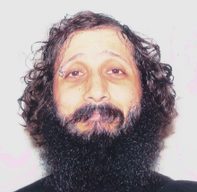
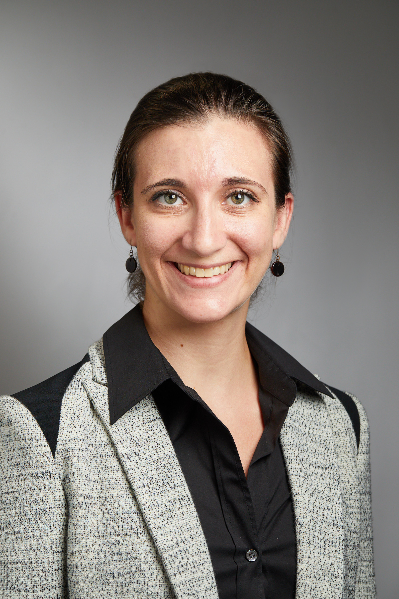
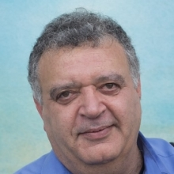

.. role:: raw-html(raw)
    :format: html

=====================================================================
Fourth layer fMRI dinner: Neurons → vessels → fMRI
=====================================================================

Overview
########

On Oct 6th 2021, we hosted the 4th virtual layer-fMRI dinner.

The board of the layer-fMRI dinner group invited the following speakers to initiate discussions on the theme: **Layer-fMRI signal origin: From neurons to vessels to BOLD**.

- **Jonathan Polimeni (MGH)**: Discussing the utility of biophysical modeling for interpreting fMRI signals and relating them back to neuronal activity (i.e. tackling the “inverse problem”).

- **Evelyn Lake (Yale)**: Leveraging simultaneous multi-modal fMRI and wide-field optical imaging to study functional brain networks

- **Amir Shmuel (McGill)**: The complexity of lamina resolved neuronal activity, and the spatial specificity of BOLD, CBV, arterioles and venules responses: implications for planning and interpreting depth-dependent fMRI.

Moderated by Luca Vizioli and Andrew Morgan

Organised by the Laminauts Board:  Johanna Bergmann, Avery Berman, Saskia Bollmann, Denis Chaimow, Renzo Huber, Andrew Morgan, Nils Nothnagel, René Scheeringa, Bianca van Kemenade and Luca Vizioli.

The entire event lasted about 90 min (including discussion) and was published on Youtube and embedded on this website.

|

.. table::

    +----------+--------+---------+--------+----------+-----------+---------------+
    | Brisbane | Korea  | Germany | UK     | New York | Minnesota | San Francisco |
    +==========+========+=========+========+==========+===========+===============+
    | Oct. 6   | Oct. 6 | Oct. 6  | Oct. 6 | Oct. 6   | Oct. 6    | Oct. 6        |
    +----------+--------+---------+--------+----------+-----------+---------------+
    | 11 pm    | 10 pm  | 3 pm    | 2 pm   | 9 am     | 8 am      | 6 am          |
    +----------+--------+---------+--------+----------+-----------+---------------+

|

Introduction
############

.. raw:: html

   
<iframe width="750" height="422" src="https://www.youtube.com/embed/zHNWqLaY-mM" title="YouTube video player" frameborder="0" allow="accelerometer; autoplay; clipboard-write; encrypted-media; gyroscope; picture-in-picture" allowfullscreen></iframe>

____

Jonathan Polimeni: Biophysical modeling for interpreting fMRI signals
#####################################################################

    `Jonathan Polimeni (MGH) <https://www.nmr.mgh.harvard.edu/user/7411>`_

**Biophysical modeling for interpreting fMRI signals and relating them back to neuronal activity: contemplating the “inverse problem”.**

The ultimate limits of spatial and temporal resolution achievable by fMRI are dictated by neurovascular coupling, the mechanisms of blood flow regulation, and vascular architecture in the brain. While these limits are currently unknown, there is a rapidly growing body of evidence pointing to the ability of fMRI to distinguish site of activation across cerebral cortical depths, which can be used to infer the cortical layer or layers differentially engaged in specific tasks or functional networks. Because all fMRI signals currently in use are based on hemodynamics and hence are influenced by local vasculature, understanding how patterns of neural activity are transformed into the fMRI signals we measure can potentially aid not only in the interpretation of our data but also opens possibilities to better estimate the location (in space and time) and amplitude of the neural response from the fMRI response—to the extent that this transformation is “invertible”.

Motivated by this, the goal of this presentation is to survey recent work towards building biophysical models of the fMRI signals to help with this interpretation, with a focus on models using realistic microvascular networks and dynamics based on optical imaging and microscopy data. These models are built on first principles and are described by meaningful anatomical and physiological parameters. I will present initial results demonstrating how these models can be used to predict well- known differences in the hemodynamic response across stimulus configurations and cortical depths. While these models are complex, and simulations are computationally intensive, they can be also used to help inform simpler “lumped” models that are more practical for routine use, and are applicable to predicting various BOLD and non-BOLD fMRI contrasts.

Another goal of this presentation is to engage the laminar fMRI community and have an open discussion about the strengths and weaknesses of this modeling approach, consider these against other approaches to improve neural specificity in fMRI, and discuss how to combine this framework with advanced acquisitions and analysis methods towards our shared objective to measure neural activity across cortical layers with fMRI.

.. raw:: html

    
<iframe width="750" height="422" src="https://www.youtube.com/embed/G80ePX24ykM" title="YouTube video player" frameborder="0" allow="accelerometer; autoplay; clipboard-write; encrypted-media; gyroscope; picture-in-picture" allowfullscreen></iframe>

|
|

____

Evelyn Lake: Simultaneous multi-modal fMRI and wide-field optical imaging
#########################################################################

    `Evelyn Lake (Yale) <https://medicine.yale.edu/profile/evelyn_lake/>`_

**Leveraging simultaneous multi-modal fMRI and wide-field optical imaging to study functional brain networks.**

.. raw:: html

   
<iframe width="750" height="422" src="https://www.youtube.com/embed/InVli16tRwM" title="YouTube video player" frameborder="0" allow="accelerometer; autoplay; clipboard-write; encrypted-media; gyroscope; picture-in-picture" allowfullscreen></iframe>

|
|

____

Amir Shmuel: Complexity of lamina-resolved neuronal activity
############################################################

    `Amir Shmuel (McGill) <https://www.mcgill.ca/neuro/amir-shmuel-phd>`_

**The complexity of lamina resolved neuronal activity, and the spatial specificity of BOLD, CBV, arterioles and venules responses: implications for planning and interpreting depth-dependent fMRI**

.. raw:: html

   
<iframe width="750" height="422" src="https://www.youtube.com/embed/KdjS6kVSSpQ" title="YouTube video player" frameborder="0" allow="accelerometer; autoplay; clipboard-write; encrypted-media; gyroscope; picture-in-picture" allowfullscreen></iframe>

|
|

____

Discussion
##########

.. raw:: html

   
<iframe width="750" height="422" src="https://www.youtube.com/embed/wI8ksRfMZLM" title="YouTube video player" frameborder="0" allow="accelerometer; autoplay; clipboard-write; encrypted-media; gyroscope; picture-in-picture" allowfullscreen></iframe>
