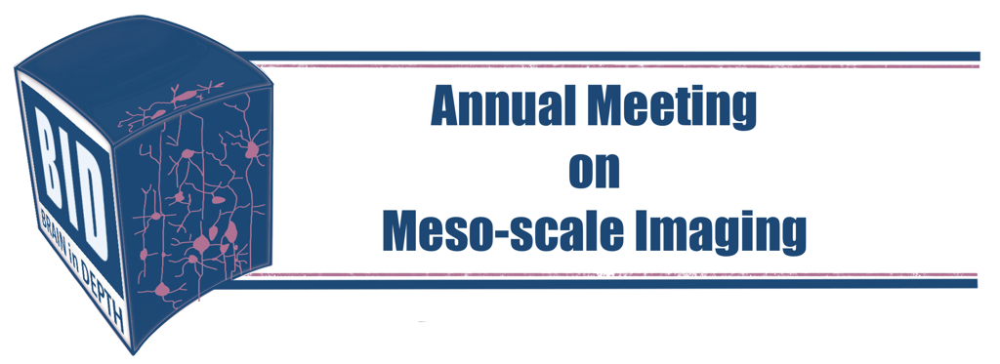
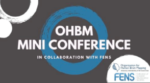
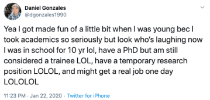
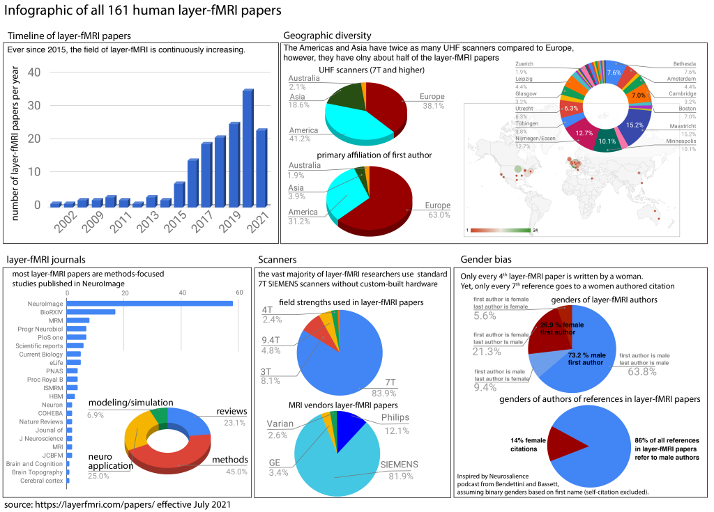

====================
Resources
====================

.. role:: raw-html(raw)
    :format: html

Here we collect resources that are helpful for layer fMRI researchers:

- `Brain in depth conference series by Esther Kuehn <http://www.estherkuehn-science.org/brain-in-depth.html>`_

|
|

____

- `Multiscale, multimethod human brain imaging (organised by Lars Muckli and Lucy Petro) <https://layerfmri.com/2020/07/16/fens-webinar-on-layer-fmri/>`_

|
|
|

____

- `Slack channel <https://tinyurl.com/cdrfmri1>`_

|

____

- `layer fMRI Job Board <https://layerfmri.com/jobs/>`_

|
|
|
|
|

____

- `List of all layer fMRI papers <https://layerfmri.com/papers/>`_
